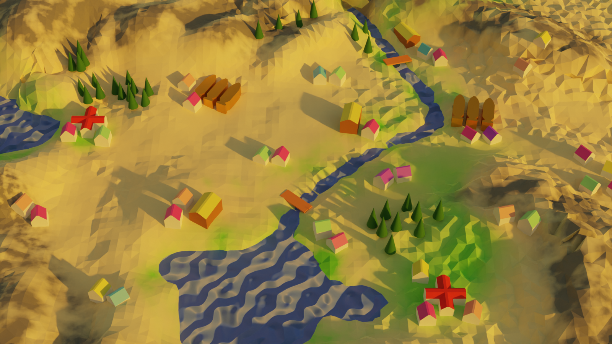
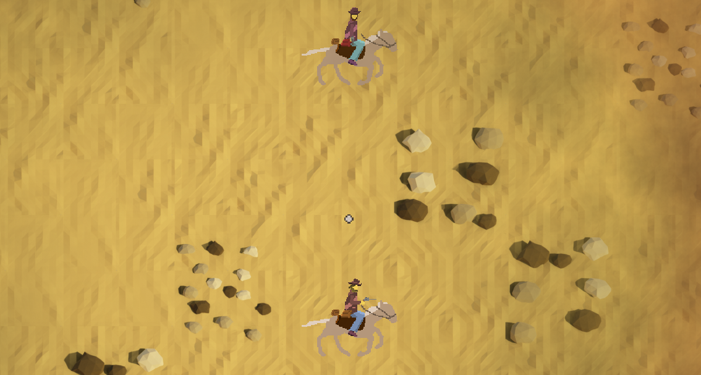
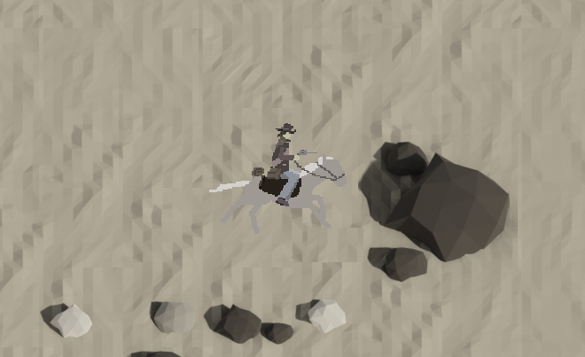

# Gone Out West

A Java LibGDX game made for Ludum Dare 50 in around 20 hours. Any updates to the project will probably be made here first.

Initial state of the repo corresponds to the initial LD release.

## Original game teaser

## The Last Adventure Calls

*~~Goin'~~ GONE OUT WEST* is the last adventure of the **Hero**, who tries to keep **Her** alive as long as possible.

It **does not matter** whether **Hero** can succeed; for God knows, **he will try anyways**.

### Content

Travel through **Westlandia** as **Hero**, earning money by delivering letters between towns...

...or delivering enemies to their final destination...

Remember... live without **Her** is bleak.

